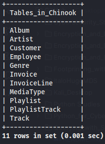
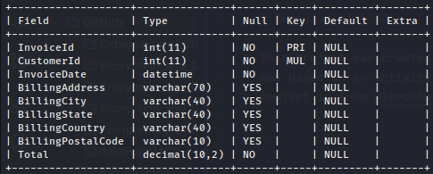
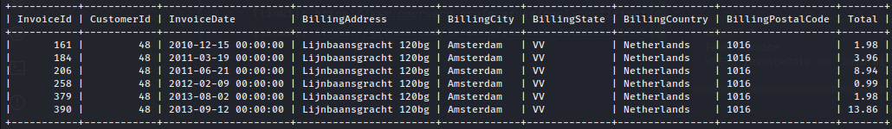
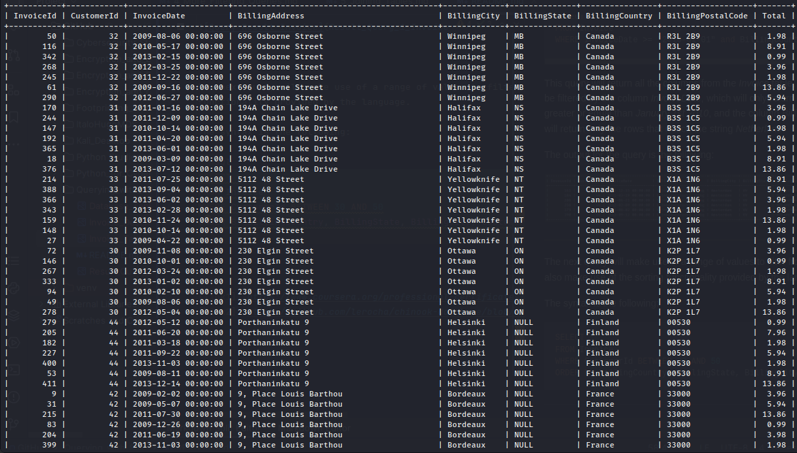
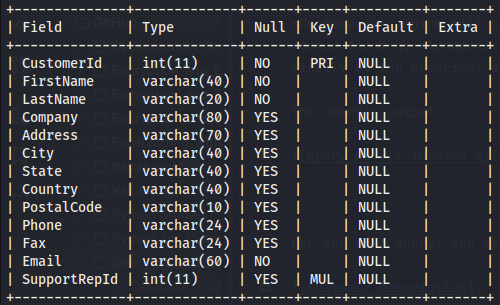
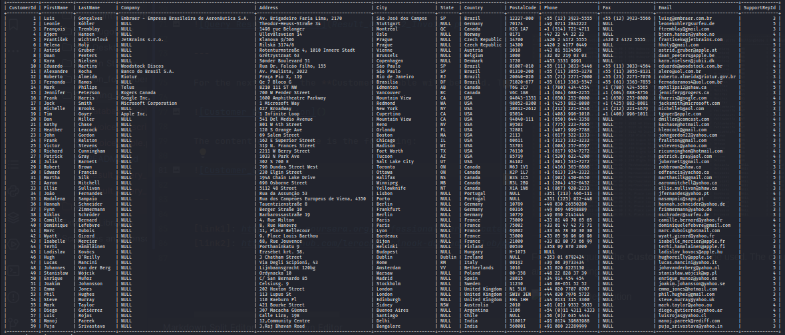

# Querying with SQL  

This project was created as a skill showcase project for my studies of SQL querying. The template used for this document
was based on an activity during the [Google Cybersecurity Professional Certificate][link1]. The database used for this
project is from [@lerocha][link3], and it's referenced [here][link2].  

---

The database used here is a version of **Chinook**. The tables contained within the dataset are the following:  



The queries were done using *SQL* language and ran within a **MariaDB** application.  

---

## Running queries  

The first queries will use the **Invoice** table to retrieve and filter from information. The keys contained within this
table are the following:  



The table consists of the following information:  


---

### 1. Query  

The first query makes use of filtering and logical conditionals. The query used has the following syntax:  

```sql
SELECT *
FROM Invoice
WHERE InvoiceDate >= "2010-01-01" and BillingCountry = "Netherlands";
```

This query will return all the columns from the *Invoice* table, but the data will be filtered by the column
*InvoiceDate*, which will only return the rows that are greater or equal than *January 1st 2010*, and the column
*BillingCountry*, which will return only the rows that match the string *Netherland*.  

The output for the query is the following:  



---

### 2. Query  

The next query will make use of a range of values to filter from the data, it will also make use of the sorting
functionality provided by the language.  

The syntax is the following:  

```sql
SELECT *
FROM Invoice
WHERE CustomerId BETWEEN 30 AND 50
ORDER BY BillingCountry, BillingState, BillingCity, CustomerId;
```

This query will return all columns from the *Invoice* table. However, the rows will be filtered by the column
*CustomerId*, which will only return the ids within the defined range, starting at *30* until *50*. The output will be
sorted first by alphabetical order of the *BillingCountry* column, followed by the *BillingState*, and *BillingCity*,
finally by the numerical order of the *CustomerId* column.  

The query's output:  



---

### 3. Query  

For the next query, the **Customer** table will be used. The columns of the table are the following:  



The content of the table is the following:  



The query will make use of column selection, exclusive filter, and wildcard searching for filtering through data.  

The syntax for the query is the following:  

```sql
SELECT CustomerId, FirstName, LastName, Company, Address, City, State, Country, Phone, Email
FROM Customer
WHERE Company <> "NULL" AND Email LIKE "%com%";
```

The query returns only the columns stated in the *SELECT* statement. From there on, the filter is applied to return the
rows that are different from the *NULL* value within the column *Company*. Another filter is applied to the column
*Email*, using the reserved wildcard `%`, to search for strings that match the *"com"* substring.  

The output for the query would be the following:  


---

### 4. Query  

---

[link1]: https://www.coursera.org/professional-certificates/google-cybersecurity
[link2]: https://github.com/lerocha/chinook-database/blob/master/ChinookDatabase/DataSources/Chinook_MySql.sql
[link3]: https://github.com/lerocha
