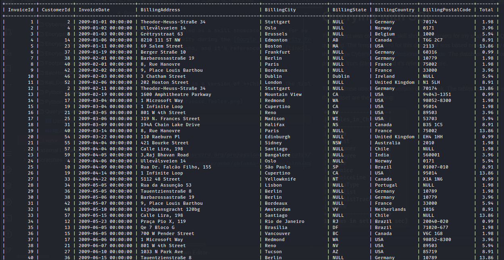
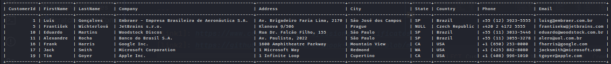

# Querying with SQL  

This project was created as a skill showcase project for my studies of SQL querying. The template used for this document
was based on an activity during the [Google Cybersecurity Professional Certificate][link1]. The database used for this
project is from [@lerocha][link3], and it's referenced [here][link2].  

---

The database used here is a version of **Chinook**. The tables contained within the dataset are the following:  


The queries were done using *SQL* language and ran within a **MariaDB** application.  

---

## Running queries  

The first queries will use the **Invoice** table to retrieve and filter for information. The keys contained within this
table are the following:  


The table consists of the following information:  



---

### 1. Query  

The first query makes use of filtering and logical conditionals.  

The query used has the following syntax:  

```sql
SELECT *
FROM Invoice
WHERE InvoiceDate >= "2010-01-01" and BillingCountry = "Netherlands";
```

This query will return all the columns from the *Invoice* table, but the data will be filtered by the column
*InvoiceDate*, which will only return the rows that are greater or equal than *January 1st 2010*, and the column
*BillingCountry*, which will return only the rows that match the string *Netherland*.  

The output for the query is the following:  


---

### 2. Query  

The next query will make use of a range of values to filter from the data, it will also make use of the sorting
functionality provided by the language.  

The syntax is the following:  

```sql
SELECT *
FROM Invoice
WHERE CustomerId BETWEEN 30 AND 50
ORDER BY BillingCountry, BillingState, BillingCity, CustomerId;
```

This query will return all columns from the *Invoice* table. However, the rows will be filtered by the column
*CustomerId*, which will only return the ids within the defined range, starting at *30* until *50*. The output will be
sorted first by alphabetical order of the *BillingCountry* column, followed by the *BillingState*, and *BillingCity*,
finally by the numerical order of the *CustomerId* column.  

The query's output:  


---

### 3. Query  

For the next query, the **Customer** table will be used. The columns of the table are the following:  


The content of the table is the following:  


The query will make use of column selection, exclusive filter, and wildcard searching for filtering through data.  

The syntax for the query is the following:  

```sql
SELECT CustomerId, FirstName, LastName, Company, Address, City, State, Country, Phone, Email
FROM Customer
WHERE Company <> "NULL" AND Email LIKE "%com%";
```

The query returns only the columns stated in the *SELECT* statement. From there on, the filter is applied to return the
rows that are different from the *NULL* value within the column *Company*. Another filter is applied to the column
*Email*, using the reserved wildcard `%`, to search for strings that match the *"com"* substring.  

The output for the query would be the following:  



---

### 4. Query  

In this query, two columns will be joined by some methods. The columns to be joined will be the **Artist** and the
**Album**. The first joining will use the `FULL OUTER JOIN`, which is a very broad and inclusive way to return data from
both tables. The second method used will be the `INNER JOIN`, which is a neater way to retrieve data from both tables.  

#### Columns within the Artist table  


#### Content of the Artist table  


#### Columns within the Album table  


#### Content of the Artist table  


The first query will use the following syntax to execute junction via the `FULL OUTER JOIN` method:  

```sql
SELECT Artist.ArtistId, Name, Title, AlbumId FROM Artist LEFT JOIN Album ON Artist.ArtistId = Album.ArtistId
UNION
SELECT Artist.ArtistId, Name, Title, AlbumId FROM Artist RIGHT JOIN Album ON Artist.ArtistId = Album.ArtistId;
```

Even though the *SQL* language contains the `FULL OUTER JOIN` syntax, the **mariadb** application doesn't support it.
Therefore, in order to have the same result as the previous command, the application allows running the `RIGHT JOIN` and
the `LEFT JOIN` commands and unifying their output together within one query result. This will make the same result as
the `FULL OUTER JOIN` command.  

The syntax used for the query will return the *Artist*, *Name*, *Title*, *AlbumId* columns from both *Artist* and
*Album* tables. As previously explained, the command will have the same effect as the `FULL OUTER JOIN`.  

The junction between tables needs a shared column from both of them, so that the output rows can be aligned correctly.
In this example, both tables have the *ArtistId* column in common, which means that this column will be used as a
reference column to align all the data from both column.  

The `FULL OUTER JOIN` command is not very effective because it will return all the data from both columns, even if one 
of the columns doesn't have data to match the reference column, in this example the *ArtistId* column. But the command
can be useful in some cases, for example, to have an idea of the entire dataset that needs to be yielded from the
columns.  

The output for this query will be the following:  


The columns can also be joined in a more effective way. This will make use of the `INNER JOIN` command.  

The syntax is the following:  

```sql
SELECT Artist.ArtistId, Name, Title, AlbumId FROM Artist
INNER JOIN Album ON Artist.ArtistId = Album.ArtistId;
```

This query will retrieve a similar output as the query using the `FULL OUTER JOIN` command.  

The difference is that, the `FULL OUTER JOIN` will fill the rows from the *Album* table, which don't have data to match
the rows from the *ArtistId* column of the *Artist* table, with `ǸULL` values. But it still will retrieve **all** the
rows from both tables.  

The `INNER JOIN` command will only retrieve the rows from both tables if those rows have data to match the other
all the columns from both tables.  

For example, in the `FULL OUTER JOIN` query, the *ArtistId* **25** didn't have any data in the *Title* column, which
came from the *Album* table, so command filled the row of this column with the `NULL` value, this is how the command
works. In the output for the `INNER JOIN` command, the *ArtistId* **25** row wasn't return by the query because the
column *Title* didn't have any data to match this row, so the command didn't retrieve the row at all and this is how the
command works.  

The output for this query will be the following:  


---

[link1]: https://www.coursera.org/professional-certificates/google-cybersecurity
[link2]: https://github.com/lerocha/chinook-database/blob/master/ChinookDatabase/DataSources/Chinook_MySql.sql
[link3]: https://github.com/lerocha
